<div align="center"><a name="readme-top"></a>

# GitHub Actions Workflows for Multi-Platform App Development


&copy; 2024 [Mifos Initiative](https://github.com/openMF)

</div>


<details>
<summary><kbd>Table of contents</kbd></summary>

#### TOC
- [✨ Multi-Platform App Build and Publish Workflow](#multi-platform-app-build-and-publish-workflow)
  - [Workflow Usage Example](#workflow-usage-example)
- [✨ Kotlin/JS Web Application GitHub Pages Deployment Workflow](#kotlinjs-web-application-github-pages-deployment-workflow)
  - [Workflow Configuration](#workflow-configuration)
- [✨ Monthly Version Tagging Workflow](#monthly-version-tagging-workflow)
  - [Workflow Configuration](#workflow-configuration-1)
- [✨ PR Check Workflow](#pr-check-workflow)
  - [Workflow Usage Example](#workflow-usage-example-1)
- [✨ Promote Release to Play Store Workflow](#promote-release-to-play-store-workflow)
  - [Configuration Steps](#configuration-steps)

####
</details>

## Kotlin Multiplatform Project Setup Guide

### Supported Platforms
- Android
- iOS
- Desktop (Windows, macOS, Linux)
- Web (Kotlin/JS, wasmJS)

### Recommended Project Structure
```
project-root/
│
├── buildLogic/            # Shared build configuration
├── gradle/                # Gradle wrapper and configuration
│
├── core/                  # Core business logic module
│   ├── common/            # Common code shared across platforms
│   ├── model/             # Model classes and data structures
│   ├── data/              # Data models and repositories
│   ├── network/           # Networking and API clients
│   ├── domain/            # Domain-specific logic
│   ├── ui/                # UI components and screens
│   ├── designsystem/      # App-wide design system
│   └── datastore/         # Local data storage
│
├── feature/               # Feature Specific module
│   ├── feature-a/         # Feature-specific logic
│   ├── feature-b/         # Feature-specific logic
│   └── feature-c/         # Feature-specific logic
│
├── androidApp/            # Android-specific implementation
├── iosApp/                # iOS-specific implementation
├── desktopApp/            # Desktop application module
├── webApp/                # Web application module
│
├── shared/                # Shared Kotlin Multiplatform code
│   ├── src/
│   │   ├── commonMain/    # Shared business logic
│   │   ├── androidMain/   # Android-specific code
│   │   ├── iosMain/       # iOS-specific code
│   │   ├── desktopMain/   # Desktop-specific code
│   │   ├── jsMain/        # Web-specific code
│       └── wasmJsMain/    # Web-specific code
│
├── Fastfile              # Fastlane configuration
├── Gemfile               # Ruby dependencies
└── fastlane/             # Fastlane configurations
```

### Development Environment
- JDK 17 or higher
- Kotlin 1.9.x
- Gradle 8.x
- Android Studio Hedgehog or later
- Xcode 15+ (for iOS development)
- Node.js 18+ (for web development)

### Required Github Secrets

In order to automate the build and deployment process, you need to configure the following secrets in your GitHub repository settings:

| Platform          | Key Name                           | Description                                                                  | Encoding/Format | Required |
|-------------------|------------------------------------|------------------------------------------------------------------------------|-----------------|----------|
| Android           | `ORIGINAL_KEYSTORE_FILE`           | Base64 encoded release keystore                                              | Base64          | Yes      |
| Android           | `ORIGINAL_KEYSTORE_FILE_PASSWORD`  | Keystore password                                                            | String          | Yes      |
| Android           | `ORIGINAL_KEYSTORE_ALIAS`          | Keystore alias                                                               | String          | Yes      |
| Android           | `ORIGINAL_KEYSTORE_ALIAS_PASSWORD` | Keystore alias password                                                      | String          | Yes      |
|                   |                                    |                                                                              |                 |          |
| Android           | `UPLOAD_KEYSTORE_FILE`             | Base64 encoded release keystore for upload                                   | Base64          | Yes      |
| Android           | `UPLOAD_KEYSTORE_FILE_PASSWORD`    | Upload keystore password                                                     | String          | Yes      |
| Android           | `UPLOAD_KEYSTORE_ALIAS`            | Upload keystore alias                                                        | String          | Yes      |
| Android           | `UPLOAD_KEYSTORE_ALIAS_PASSWORD`   | Upload keystore alias password                                               | String          | Yes      |
|                   |                                    |                                                                              |                 |          |
| Google Services   | `GOOGLESERVICES`                   | Google Services JSON content                                                 | Base64          | Yes      |
| Play Console      | `PLAYSTORECREDS`                   | Play Store service account credentials                                       | Base64          | Yes      |
| Firebase          | `FIREBASECREDS`                    | Firebase App Distribution credentials                                        | Base64          | Yes      |
|                   |                                    |                                                                              |                 |          |
| iOS               | `NOTARIZATION_APPLE_ID`            | Apple ID for app notarization                                                | String          | Yes      |
| iOS               | `NOTARIZATION_PASSWORD`            | Password for notarization process                                            | String          | Yes      |
| iOS               | `NOTARIZATION_TEAM_ID`             | Apple Developer Team ID                                                      | String          | Yes      |
| iOS               | `APPSTORE_KEY_ID`             | App Store Connect API key ID                                                 | String          | Yes      |
| iOS               | `APPSTORE_ISSUER_ID`             | App Store Connect issuer ID                                                  | String          | Yes      |
| iOS               | `APPSTORE_AUTH_KEY`             | Base64-encoded App Store Connect API key content                             | String          | Yes      |
| iOS               | `MATCH_SSH_PRIVATE_KEY`    | Base64-encoded SSH private key for Match repository access                   | String          | Yes      |
| iOS               | `MATCH_PASSWORD`                   | Password to decrypt the provisioning profiles and certificates used by Match | String          | Yes      |
|                   |                                    |                                                                              |                 |          |
| macOS             | `KEYCHAIN_PASSWORD`                   | Password for the temporary signing keychain                                 | String | Yes      |
| macOS             | `CERTIFICATES_PASSWORD`               | Password used to import signing certificates into the keychain              | String | Yes      |
| macOS             | `MAC_APP_DISTRIBUTION_CERTIFICATE_B64` | Base64-encoded macOS App Distribution certificate (.p12)                    | String | Yes      |
| macOS             | `MAC_INSTALLER_DISTRIBUTION_CERTIFICATE_B64` | Base64-encoded macOS Installer Distribution certificate (.p12)       | String | Yes      |
| macOS             | `MAC_EMBEDDED_PROVISION_B64`          | Base64-encoded embedded provisioning profile (.provisionprofile)            | String | Yes      |
| macOS             | `MAC_RUNTIME_PROVISION_B64`           | Base64-encoded runtime provisioning profile (.provisionprofile)             | String | Yes      |
|                   |                                    |                                                                              |                 |          |
| Desktop (Windows) | `WINDOWS_SIGNING_KEY`              | Signing key for Windows application                                          | String          | No       |
| Desktop (Windows) | `WINDOWS_SIGNING_PASSWORD`         | Password for Windows signing key                                             | String          | No       |
| Desktop (Windows) | `WINDOWS_SIGNING_CERTIFICATE`      | Certificate for Windows app signing                                          | String          | No       |
|                   |                                    |                                                                              |                 |          |
| Desktop (MacOS)   | `MACOS_SIGNING_KEY`                | Signing key for MacOS application                                            | String          | No       |
| Desktop (MacOS)   | `MACOS_SIGNING_PASSWORD`           | Password for MacOS signing key                                               | String          | No       |
| Desktop (MacOS)   | `MACOS_SIGNING_CERTIFICATE`        | Certificate for MacOS app signing                                            | String          | No       |
|                   |                                    |                                                                              |                 |          |
| Desktop (Linux)   | `LINUX_SIGNING_KEY`                | Signing key for Linux application                                            | String          | No       |
| Desktop (Linux)   | `LINUX_SIGNING_PASSWORD`           | Password for Linux signing key                                               | String          | No       |
| Desktop (Linux)   | `LINUX_SIGNING_CERTIFICATE`        | Certificate for Linux app signing                                            | String          | No       |


### Fastlane Setup

#### Install Fastlane
```bash
# Install Ruby (if not already installed)
brew install ruby

# Install Fastlane
gem install fastlane

# Create Gemfile
bundle init

# Add Fastlane to Gemfile
bundle add fastlane
```

#### Fastfile Configuration
`Fastfile`:
```ruby
default_platform(:android)

platform :android do
  desc "Assemble debug APKs."
  lane :assembleDebugApks do |options|
    gradle(
      tasks: ["assembleDebug"],
    )
  end

  desc "Assemble Release APK"
  lane :assembleReleaseApks do |options|
    options[:storeFile] ||= "release_keystore.keystore"
    options[:storePassword] ||= "Mifospay"
    options[:keyAlias] ||= "key0"
    options[:keyPassword] ||= "Mifos@123"

    # Generate version
    generateVersion = generateVersion()

    buildAndSignApp(
      taskName: "assemble",
      buildType: "Release",
      storeFile: options[:storeFile],
      storePassword: options[:storePassword],
      keyAlias: options[:keyAlias],
      keyPassword: options[:keyPassword],
    )
  end

  desc "Bundle Play Store release"
  lane :bundlePlayStoreRelease do |options|
    options[:storeFile] ||= "release_keystore.keystore"
    options[:storePassword] ||= "Mifospay"
    options[:keyAlias] ||= "key0"
    options[:keyPassword] ||= "Mifos@123"

    # Generate version
    generateVersion = generateVersion()

    # Generate Release Note
    releaseNotes = generateReleaseNotes(
      repoName: "mobile-wallet-testing",
    )

    # Write the generated release notes to default.txt
    buildConfigPath = "metadata/android/en-GB/changelogs/default.txt"
    File.write(buildConfigPath, releaseNotes)

    buildAndSignApp(
      taskName: "bundle",
      buildType: "Release",
      storeFile: options[:storeFile],
      storePassword: options[:storePassword],
      keyAlias: options[:keyAlias],
      keyPassword: options[:keyPassword],
    )
  end

  desc "Publish Release Play Store artifacts to Firebase App Distribution"
  lane :deploy_on_firebase do |options|
    options[:apkFile] ||= "mifospay-android/build/outputs/apk/prod/release/mifospay-android-prod-release.apk"
    options[:serviceCredsFile] ||= "secrets/firebaseAppDistributionServiceCredentialsFile.json"
    options[:groups] ||= "mifos-wallet-testers"

    # Generate Release Note
    releaseNotes = generateReleaseNotes(
      repoName: "mobile-wallet-testing",
    )

    firebase_app_distribution(
      app: "1:64530857057:android:f8d67b786db1b844",
      android_artifact_type: "APK",
      android_artifact_path: options[:apkFile],
      service_credentials_file: options[:serviceCredsFile],
      groups: options[:groups],
      release_notes: "#{releaseNotes}",
    )
  end

  desc "Deploy internal tracks to Google Play"
  lane :deploy_internal do |options|
    options[:aabFile] ||= "mifospay-android/build/outputs/bundle/prodRelease/mifospay-android-prod-release.aab"
    upload_to_play_store(
      track: 'internal',
      aab: options[:aabFile],
      skip_upload_metadata: true,
      skip_upload_images: true,
      skip_upload_screenshots: true,
    )
  end

  desc "Promote internal tracks to beta on Google Play"
  lane :promote_to_beta do
    upload_to_play_store(
      track: 'internal',
      track_promote_to: 'beta',
      skip_upload_changelogs: true,
      skip_upload_metadata: true,
      skip_upload_images: true,
      skip_upload_screenshots: true,
    )
  end

  desc "Promote beta tracks to production on Google Play"
  lane :promote_to_production do
    upload_to_play_store(
      track: 'beta',
      track_promote_to: 'production',
      skip_upload_changelogs: true,
      skip_upload_metadata: true,
      skip_upload_images: true,
      skip_upload_screenshots: true,
    )
  end

  desc "Generate artifacts for the given [build] signed with the provided [keystore] and credentials."
  private_lane :buildAndSignApp do |options|
    # Get the project root directory
    project_dir = File.expand_path('..', Dir.pwd)

    # Construct the absolute path to the keystore
    keystore_path = File.join(project_dir, 'keystores', options[:storeFile])

    # Check if keystore exists
    unless File.exist?(keystore_path)
      UI.error "Keystore file not found at: #{keystore_path}"
      UI.error "Please ensure the keystore file exists at the correct location"
      exit 1  # Exit with error code 1
    end

    gradle(
      task: options[:taskName],
      build_type: options[:buildType],
      properties: {
        "android.injected.signing.store.file" => keystore_path,
        "android.injected.signing.store.password" => options[:storePassword],
        "android.injected.signing.key.alias" => options[:keyAlias],
        "android.injected.signing.key.password" => options[:keyPassword],
      },
      print_command: false,
    )
  end

  desc "Generate Version"
  lane :generateVersion do
    # Generate version file
    gradle(tasks: ["versionFile"])

    # Set version from file
    ENV['VERSION'] = File.read("../version.txt").strip

    # Calculate and set version code
    commit_count = `git rev-list --count HEAD`.to_i
    tag_count = `git tag | grep -v beta | wc -l`.to_i
    ENV['VERSION_CODE'] = ((commit_count + tag_count) << 1).to_s

    UI.success("Set VERSION=#{ENV['VERSION']} VERSION_CODE=#{ENV['VERSION_CODE']}")
  end

  desc "Generate release notes"
  lane :generateReleaseNotes do |options|
    branchName = `git rev-parse --abbrev-ref HEAD`.chomp()
    releaseNotes = changelog_from_git_commits(
      commits_count: 1,
    )
    releaseNotes
  end

end

platform :ios do

  #############################
  # Shared Private Lane Helpers
  #############################

  private_lane :setup_ci_if_needed do
      unless ENV['CI']
          UI.message("🖥️ Running locally, skipping CI-specific setup.")
      else
          setup_ci
      end
  end

  private_lane :load_api_key do |options|
      app_store_connect_api_key(
        key_id: options[:appstore_key_id] || "HA469T6757",
        issuer_id: options[:appstore_issuer_id] || "8er9e361-9603-4c3e-b147-be3b1o816099",
        key_filepath: options[:key_filepath] || "./secrets/Auth_Key.p8",
        duration: 1200
      )
  end

  private_lane :fetch_certificates_with_match do |options|
      match(
        type: options[:match_type] || "adhoc",
        app_identifier: options[:app_identifier] || "com.example.9af3c1d2",
        readonly: true,
        git_url: options[:git_url] || "git@github.com:openMF/ios-provisioning-profile.git",
        git_branch: options[:git_branch] || "master",
        git_private_key: options[:git_private_key] || "./secrets/match_ci_key",
        force_for_new_devices: true,
        api_key: Actions.lane_context[SharedValues::APP_STORE_CONNECT_API_KEY]
      )
  end

  private_lane :build_ios_project do |options|
      app_identifier = options[:app_identifier] || "com.example.9af3c1d2"
      provisioning_profile_name = options[:provisioning_profile_name] || "match AdHoc com.example.9af3c1d2"

      cocoapods(
        podfile: "cmp-ios/Podfile",
        clean_install: true,
        repo_update: true
      )
      
      update_code_signing_settings(
        use_automatic_signing: false,
        path: "cmp-ios/iosApp.xcodeproj",
        targets: "iosApp",
        team_id: "G432R4FZP6",
        code_sign_identity: "Apple Distribution",
        profile_name: provisioning_profile_name,
        bundle_identifier: "com.example.9af3c1d2"
      )
      
      build_ios_app(
        scheme: "iosApp",
        workspace: cmp-ios/iosApp.xcworkspace,
        output_name: "iosApp.ipa",
        output_directory: "cmp-ios/build",
        skip_codesigning: "Release"
      )
  end

  ###################
  # Main Public lanes
  ###################

  desc "Build Ios application"
  lane :build_ios do |options|
    options[:scheme] ||= "iosApp"
    options[:project_path] ||= "cmp-ios/iosApp.xcodeproj"
    options[:output_name] ||= "iosApp.ipa"
    options[:output_directory] ||= "cmp-ios/build"

    cocoapods(
      podfile: "cmp-ios/Podfile",
      clean_install: true,
      repo_update: true
    )
      
    build_ios_app(
      scheme: options[:scheme],
      project: options[:project_path],
      output_name: options[:output_name],
      output_directory: options[:output_directory],
      skip_codesigning: true,
      skip_archive: true
    )
  end

  desc "Build Signed Ios application"
  lane :build_signed_ios do |options|
    setup_ci_if_needed
    load_api_key(options)
    fetch_certificates_with_match(options)
    build_ios_project(options)
  end

  desc "Increment build number from latest Firebase release"
  lane :increment_version do |options|
  service_file = options[:serviceCredsFile] || "./secrets/firebaseAppDistributionServiceCredentialsFile.json"

    latest_release = firebase_app_distribution_get_latest_release(
      app: options[:firebase_app_id] || "1:728434912738:ios:1d81f8e53ca7a6f31a1dbb",
      service_credentials_file: service_file
    )

    if latest_release
      increment_build_number(
        xcodeproj: "cmp-ios/iosApp.xcodeproj",
        build_number: latest_release[:buildVersion].to_i + 1
      )
    else
      UI.important("⚠️ No existing Firebase release found. Skipping build number increment.")
    end
  end

  desc "Generate release notes"
  lane :generateReleaseNote do
    branchName = `git rev-parse --abbrev-ref HEAD`.chomp()
    releaseNotes = changelog_from_git_commits(
      commits_count: 1,
    )
    releaseNotes
  end

  desc "Upload iOS application to Firebase App Distribution"
  lane :deploy_on_firebase do |options|
  service_file = options[:serviceCredsFile] || "./secrets/firebaseAppDistributionServiceCredentialsFile.json"
  groups = options[:groups] || "mifos-mobile-testers"
  firebase_app_id = options[:firebase_app_id] ||= "1:728434912738:ios:1d81f8e53ca7a6f31a1dbb"

    increment_version(serviceCredsFile: service_file)

    build_signed_ios(
        options.merge(
            match_type: "adhoc",
            provisioning_profile_name: "match AdHoc com.example.9af3c1d2"
        )
    )

    releaseNotes = generateReleaseNote()

    firebase_app_distribution(
      app: firebase_app_id,
      service_credentials_file: service_file,,
      release_notes: releaseNotes,
      groups: groups
    )
  end

  desc "Upload beta build to TestFlight"
  lane :beta do |options|

      setup_ci_if_needed
      load_api_key(options)
      fetch_certificates_with_match(
        options.merge(match_type: "appstore")
      )

      increment_version_number(
        xcodeproj: "cmp-ios/iosApp.xcodeproj",
        version_number: "1.0.0"
      )

      latest_build_number = latest_testflight_build_number(
        app_identifier: options[:app_identifier] || "com.example.9af3c1d2",
        api_key: Actions.lane_context[SharedValues::APP_STORE_CONNECT_API_KEY]
      )

      increment_build_number(
        xcodeproj: "cmp-ios/iosApp.xcodeproj",
        build_number: latest_build_number + 1
      )

      build_ios_project(
        options.merge(
            provisioning_profile_name: "match AppStore com.example.9af3c1d2"
        )
      )

      pilot(
        api_key: Actions.lane_context[SharedValues::APP_STORE_CONNECT_API_KEY],
        skip_waiting_for_build_processing: true
      )
  end
  
  desc "Upload iOS Application to AppStore"
  lane :release do |options|

      setup_ci_if_needed
      load_api_key(options)
      fetch_certificates_with_match(
        options.merge(match_type: "appstore")
      )

      increment_version_number(
        xcodeproj: "cmp-ios/iosApp.xcodeproj",
        version_number: "1.0.0"
      )

      latest_build_number = latest_testflight_build_number(
        app_identifier: options[:app_identifier] || "com.example.9af3c1d2",
        api_key: Actions.lane_context[SharedValues::APP_STORE_CONNECT_API_KEY]
      )

      increment_build_number(
        xcodeproj: "cmp-ios/iosApp.xcodeproj",
        build_number: latest_build_number + 1
      )
      
      update_plist(
        plist_path: "cmp-ios/iosApp/Info.plist",
        block: proc do |plist|
          plist['NSContactsUsageDescription'] = 'This app requires access to your contacts to enable autofill and collaboration features.'
          plist['NSLocationWhenInUseUsageDescription'] = 'This app does not use your location to suggest services near you.'
          plist['NSBluetoothAlwaysUsageDescription'] = 'This app does not use Bluetooth to communicate with nearby devices.'
        end
      )

      build_ios_project(
        options.merge(
            provisioning_profile_name: "match AppStore com.example.9af3c1d2"
        )
      )
      
      deliver(
        screenshots_path: "./fastlane/screenshots_ios",
        metadata_path: options[:metadata_path] || "./fastlane/metadata",
        submit_for_review: true,
        automatic_release: true,
        api_key: Actions.lane_context[SharedValues::APP_STORE_CONNECT_API_KEY],
        skip_app_version_update: true,
        force: true,
        precheck_include_in_app_purchases: false,
        overwrite_screenshots: true,
        app_rating_config_path: options[:app_rating_config_path] || "./fastlane/age_rating.json",
        submission_information: {
          add_id_info_uses_idfa: false,
          add_id_info_limits_tracking: false,
          add_id_info_serves_ads: false,
          add_id_info_tracks_action: false,
          add_id_info_tracks_install: false,
          content_rights_has_rights: true,
          content_rights_contains_third_party_content: false,
          export_compliance_platform: 'ios',
          export_compliance_compliance_required: false,
          export_compliance_encryption_updated: false,
          export_compliance_app_type: nil,
          export_compliance_uses_encryption: false,
          export_compliance_is_exempt: true,
          export_compliance_contains_third_party_cryptography: false,
          export_compliance_contains_proprietary_cryptography: false,
          export_compliance_available_on_french_store: true
        }
      )
  end
end
```

### Code Quality Checks
- Static code analysis (Detekt)
- Code formatting (Spotless)
- Dependency guard
- Unit and UI testing

### Release Management
- Semantic versioning
- Automated beta deployments
- Cross-platform release automation

### Resources
- [Kotlin Multiplatform Documentation](https://kotlinlang.org/docs/multiplatform.html)
- [Compose Multiplatform Guide](https://www.jetbrains.com/lp/compose-multiplatform/)
- [Fastlane Documentation](https://docs.fastlane.tools/)

<div align="right">

[](#readme-top)

</div>

---

# Multi-Platform App Build and Publish Workflow

> \[!TIP]
>  ####  _[multi_platform_build_and_publish.yaml](.github/workflows/multi-platform-build-and-publish.yaml)_ 👀️


## Overview

This GitHub Actions workflow provides a comprehensive solution for building and publishing multi-platform applications, supporting:

- Android (APK and Play Store)
- iOS (App Store and Firebase Distribution)
- Desktop (Windows, macOS, Linux)
- Web (GitHub Pages)

## Prerequisites

### Repository Setup

1. Ensure your project is organized with separate modules for each platform:

- Android module
- iOS module
- Desktop module
- Web module

2. Required configuration files:

- `fastlane/` directory with deployment configurations
- Gradle build files
- GitHub Secrets configuration

### Required GitHub Secrets

Configure the following secrets in your repository settings:

#### Android Secrets

- `ORIGINAL_KEYSTORE_FILE`: Base64 encoded release keystore
- `ORIGINAL_KEYSTORE_FILE_PASSWORD`: Keystore password
- `ORIGINAL_KEYSTORE_ALIAS`: Keystore alias
- `ORIGINAL_KEYSTORE_ALIAS_PASSWORD`: Keystore alias password
-
- `UPLOAD_KEYSTORE_FILE`: Base64 encoded release keystore
- `UPLOAD_KEYSTORE_FILE_PASSWORD`: Keystore password
- `UPLOAD_KEYSTORE_ALIAS`: Keystore alias
- `UPLOAD_KEYSTORE_ALIAS_PASSWORD`: Keystore alias password
-
- `GOOGLESERVICES`: Base64 encoded Google Services JSON content
- `PLAYSTORECREDS`: Base64 encoded Play Store service account credentials
- `FIREBASECREDS`: Base64 encoded Firebase App Distribution credentials

#### iOS Secrets

- Notarization Credentials:
  - `NOTARIZATION_APPLE_ID`
  - `NOTARIZATION_PASSWORD`
  - `NOTARIZATION_TEAM_ID`
- Fastlane Match Credentials:
  - `MATCH_SSH_PRIVATE_KEY`
  - `MATCH_PASSWORD`
- App Store Connect API Credentials:
  - `APPSTORE_KEY_ID`
  - `APPSTORE_ISSUER_ID`
  - `APPSTORE_AUTH_KEY`

#### macOS Secrets

- Keychain & Certificates:
  - `KEYCHAIN_PASSWORD`: Password for temporary signing keychain
  - `CERTIFICATES_PASSWORD`: Password used to import certificates into keychain

- macOS Signing Certificates (Base64 encoded):
  - `MAC_APP_DISTRIBUTION_CERTIFICATE_B64`: App Distribution certificate (.p12)
  - `MAC_INSTALLER_DISTRIBUTION_CERTIFICATE_B64`: Installer Distribution certificate (.p12)

- Provisioning Profiles (Base64 encoded):
  - `MAC_EMBEDDED_PROVISION_B64`: Embedded provisioning profile (.provisionprofile)
  - `MAC_RUNTIME_PROVISION_B64`: Runtime provisioning profile (.provisionprofile)

- App Store Connect API (reused from iOS):
  - `APPSTORE_KEY_ID`
  - `APPSTORE_ISSUER_ID`
  - `APPSTORE_AUTH_KEY`

## Workflow Inputs

The workflow supports the following configuration inputs:

### Release Configuration

- `release_type`:
  - Default: `'internal'`
  - Options: `'internal'`, `'beta'`
- `target_branch`:
  - Default: `'dev'`
  - Specifies the branch for release

### Platform Package Names

- `android_package_name`: Name of Android project module
- `ios_package_name`: Name of iOS project module
- `desktop_package_name`: Name of Desktop project module
- `web_package_name`: Name of Web project module

### Publishing Toggles

- `distribute_ios_firebase`: Distribute iOS App via Firebase App Distribution (Default: `false`)
- `distribute_ios_testflight`: Distribute iOS App via TestFlight (Default: `false`)
- `distribute_ios_appstore`: Distribute iOS App to Appstore (Default: `false`)
- `distribute_macos_testflight`: Distribute macOS App via TestFlight (Default: `false`)
- `distribute_macos_appstore`: Distribute macOS App to Appstore (Default: `false`)
- `distribute_desktop_external`: Distribute Desktop App builds outside official stores (Default: `true`)

### Signing & Certificates

- `app_identifier`: The unique bundle identifier for the iOS application
- `macos_app_identifier`: The unique bundle identifier for the macOS application
- `git_url`: Git URL for certificates & provisioning profiles (Fastlane Match)
- `git_branch`: Branch inside certificates repo for Match
- `match_type`: Type of provisioning profile (adhoc, appstore, development)
- `provisioning_profile_name`: Provisioning profile name to use for code signing
- `metadata_path`: Path to metadata directory (app name, description, screenshots, etc.) for App Store submission

### Firebase

- `firebase_app_id`: Firebase App ID for iOS distribution
- `tester_groups`: Firebase tester groups for internal/beta distribution

### Build System

- `use_cocoapods`: Whether to integrate Kotlin Multiplatform with CocoaPods (true/false)
- `shared_module`: Gradle path to the KMP shared module (e.g., `:cmp-shared`)
- `ci_gradle_properties_path`: Path to CI-specific Gradle properties (default: `.github/ci-gradle.properties`)
- `compose_resources_dir`: Path to Compose resources directory (default: `cmp-shared/build/compose/cocoapods/compose-resources`)
- `java-version`: Java version to use (default: `17`)
- `xcode-version`: Xcode version to use (default: `16.4`)
- `cmp_desktop_dir`: Path to the KMP desktop project used for macOS builds (default: `cmp-desktop`)
- `keychain_name`: Temporary keychain name used for macOS signing (default: `signing.keychain-db`)

## Workflow Jobs

### 1. Release Information Generation

- Generates version number
- Creates release notes
- Prepares changelog artifacts

### 2. Platform-Specific Build Jobs

#### Android

- Builds signed APK
- Uploads to Firebase App Distribution
- Optionally publishes to Play Store

#### iOS

- Builds iOS application
- Uploads to Firebase App Distribution
- Prepares for App Store submission

#### macOS

- Builds macOS application
- Optionally distributes to TestFlight
- Optionally publishes to App Store

#### Desktop

- Builds for Windows, macOS, and Linux
- Packages executables and installers

#### Web

- Builds web application
- Deploys to GitHub Pages

### 3. GitHub Release

- Creates a pre-release with all built artifacts
- Includes detailed changelog

## Workflow Usage Example

```yaml
name: Multi-Platform Build and Publish

on:
  workflow_dispatch:
    inputs:
      release_type:
        type: choice
        options:
          - internal
          - beta
        default: internal
        description: Release Type

      target_branch:
        type: string
        default: 'dev'
        description: 'Target branch for release'

      publish_android:
        type: boolean
        default: false
        description: Publish Android App On Play Store

      distribute_ios_firebase:
        type: boolean
        default: false
        description: Distribute iOS App via Firebase App Distribution
        
      distribute_ios_testflight:
        type: boolean
        default: false
        description: Distribute iOS App via TestFlight (App Store Connect)

      distribute_ios_appstore:
        type: boolean
        default: false
        description: Distribute iOS App to Appstore  

permissions:
  contents: write
  id-token: write
  pages: write

concurrency:
  group: "reusable"
  cancel-in-progress: false

jobs:
  multi_platform_build_and_publish:
    name: Multi-Platform Build and Publish
    uses: openMF/mifos-x-actionhub/.github/workflows/multi-platform-build-and-publish.yaml@v1.0.6
    with:
      java-version: 21
      xcode-version: '16.4'
      release_type: ${{ inputs.release_type }}
      target_branch: ${{ inputs.target_branch }}
      android_package_name: 'cmp-android' # <-- Change this to your android package name
      ios_package_name: 'cmp-ios' # <-- Change this to your ios package name
      desktop_package_name: 'cmp-desktop' # <-- Change this to your desktop package name
      web_package_name: 'cmp-web'   # <-- Change this to your web package name
      app_identifier: 'org.mifos.kmp.template'
      git_url: 'git@github.com:openMF/ios-provisioning-profile.git'
      git_branch: 'master'
      match_type: 'adhoc'
      provisioning_profile_name: 'match AdHoc org.mifos.kmp.template'
      firebase_app_id: '1:728434912738:ios:1d81f8e53ca7a6f31a1dbb'
      metadata_path: './fastlane/metadata'
      use_cocoapods: true
      shared_module: ':cmp-shared'
      publish_android: ${{ inputs.publish_android }}
      distribute_ios_firebase: ${{ inputs.distribute_ios_firebase }}
      distribute_ios_testflight: ${{ inputs.distribute_ios_testflight }}
      tester_groups: 'mifos-wallet-testers'
    secrets:
      original_keystore_file: ${{ secrets.ORIGINAL_KEYSTORE_FILE }}
      original_keystore_file_password: ${{ secrets.ORIGINAL_KEYSTORE_FILE_PASSWORD }}
      original_keystore_alias: ${{ secrets.ORIGINAL_KEYSTORE_ALIAS }}
      original_keystore_alias_password: ${{ secrets.ORIGINAL_KEYSTORE_ALIAS_PASSWORD }}

      upload_keystore_file: ${{ secrets.UPLOAD_KEYSTORE_FILE }}
      upload_keystore_file_password: ${{ secrets.UPLOAD_KEYSTORE_FILE_PASSWORD }}
      upload_keystore_alias: ${{ secrets.UPLOAD_KEYSTORE_ALIAS }}
      upload_keystore_alias_password: ${{ secrets.UPLOAD_KEYSTORE_ALIAS_PASSWORD }}

      notarization_apple_id: ${{ secrets.NOTARIZATION_APPLE_ID }}
      notarization_password: ${{ secrets.NOTARIZATION_PASSWORD }}
      notarization_team_id: ${{ secrets.NOTARIZATION_TEAM_ID }}
      appstore_key_id: ${{ secrets.APPSTORE_KEY_ID }}
      appstore_issuer_id: ${{ secrets.APPSTORE_ISSUER_ID }}
      appstore_auth_key: ${{ secrets.APPSTORE_AUTH_KEY }}
      match_password: ${{ secrets.MATCH_PASSWORD }}
      match_ssh_private_key: ${{ secrets.MATCH_SSH_PRIVATE_KEY }}

      windows_signing_key: ${{ secrets.WINDOWS_SIGNING_KEY }}
      windows_signing_password: ${{ secrets.WINDOWS_SIGNING_PASSWORD }}
      windows_signing_certificate: ${{ secrets.WINDOWS_SIGNING_CERTIFICATE }}

      macos_signing_key: ${{ secrets.MACOS_SIGNING_KEY }}
      macos_signing_password: ${{ secrets.MACOS_SIGNING_PASSWORD }}
      macos_signing_certificate: ${{ secrets.MACOS_SIGNING_CERTIFICATE }}

      linux_signing_key: ${{ secrets.LINUX_SIGNING_KEY }}
      linux_signing_password: ${{ secrets.LINUX_SIGNING_PASSWORD }}
      linux_signing_certificate: ${{ secrets.LINUX_SIGNING_CERTIFICATE }}

      google_services: ${{ secrets.GOOGLESERVICES }}
      firebase_creds: ${{ secrets.FIREBASECREDS }}
      playstore_creds: ${{ secrets.PLAYSTORECREDS }}
      token: ${{ secrets.GITHUB_TOKEN }}
```

## Important Considerations

1. Ensure all platform-specific build configurations are correctly set up
2. Test the workflow in a staging environment first
3. Manage secrets securely
4. Keep Fastlane and Gradle configurations up to date

## Troubleshooting

- Check GitHub Actions logs for detailed error messages
- Verify all secrets are correctly configured
- Ensure Gradle and Fastlane dependencies are compatible
- Validate platform-specific build scripts

## Limitations

- Requires comprehensive platform-specific build configurations
- Some manual setup needed for each platform
- Depends on external services (Play Store, App Store, Firebase)

<div align="right">

[](#readme-top)

</div>

---

# Kotlin/JS Web Application GitHub Pages Deployment Workflow

> \[!TIP]
> #### [_build-and-deploy-site.yaml_](.github/workflows/build-and-deploy-site.yaml)

```mermaid
---
config:
  theme: neo-dark
  look: neo
  layout: dagre
---
flowchart TD
%% Trigger Stage
    A([fa:fa-code-branch Push to Dev / Manual Trigger]) --> 
    B{{"fa:fa-server Checkout Repository"}}

%% Environment Setup
B --> C["fa:fa-coffee Setup Java Environment\n🔧 JDK Configuration"]

%% Build Process
C --> D["fa:fa-globe Build Kotlin/JS Web App\n🏗️ Compiling JavaScript"]

%% GitHub Pages Configuration
D --> E{"fa:fa-cogs Configure GitHub Pages\n⚙️ Static Site Generation"}

%% Artifact Upload
E --> F["fa:fa-upload Upload Static Web Files\n📦 Preparing Deployment Artifacts"]

%% Deployment Stage
F --> G{{"fa:fa-rocket Deploy to GitHub Pages"}}

%% Deployment Outcomes
G -->|Success| H["fa:fa-check-circle Update Deployment Environment\n✨ Environment Sync"]
G -->|Failure| I["fa:fa-undo Rollback Deployment\n🔙 Reverting Changes"]

%% Styling
classDef triggerNode fill:#2196F3,color:white,stroke:#1565C0,stroke-width:2px;
classDef processNode fill:#4CAF50,color:white,stroke:#2E7D32,stroke-width:2px;
classDef decisionNode fill:#FF9800,color:white,stroke:#EF6C00,stroke-width:2px;
classDef successNode fill:#8BC34A,color:white,stroke:#558B2F,stroke-width:2px;
classDef failureNode fill:#F44336,color:white,stroke:#C62828,stroke-width:2px;

class A triggerNode;
class B,C,D,F processNode;
class E,G decisionNode;
class H successNode;
class I failureNode;
```



## Overview

This GitHub Actions workflow automates the build and deployment of a Kotlin/JS web application to GitHub Pages. It simplifies the process of publishing your web application by automatically handling the build and deployment steps whenever changes are merged into the development branch.

## Prerequisites

Before using this workflow, ensure you have the following:

### Repository Setup

1. A Kotlin Multiplatform/JS web application project using Gradle
2. A Gradle configuration that supports `jsBrowserDistribution` task
3. GitHub repository with GitHub Pages enabled

### Build Configuration

- Configurable java version (default 17)
- Kotlin/JS project with a web module
- Gradle wrapper in the project root

## Workflow Configuration

### 1. How to Setup the Workflow

This workflow is designed as a reusable workflow. You'll need to call it from another workflow file. Create a workflow file (e.g., `.github/workflows/deploy.yml`) that looks like this:

```yaml
name: Build And Deploy Web App

# Trigger conditions for the workflow
on:
  pull_request:
    branches: [ "dev" ]
    types: [ closed ]
  workflow_dispatch:

# Concurrency settings to manage multiple workflow runs
# This ensures orderly deployment to production environment
concurrency:
  group: "web-pages"
  cancel-in-progress: false

permissions:
  contents: read  # Read repository contents
  pages: write    # Write to GitHub Pages
  id-token: write # Write authentication tokens
  pull-requests: write # Write to pull requests

jobs:
  build_and_deploy_web:
    name: Build And Deploy Web App
    uses: openMF/mifos-x-actionhub/.github/workflows/build-and-deploy-site.yaml@v1.0.6
    secrets: inherit
    with:
      web_package_name: 'mifospay-web'
      java-version: 21
```

Replace `'your-web-module-name'` with the actual name of your web module in the Gradle project.

### 2. GitHub Pages Configuration

#### Repository Settings

1. Go to your repository's "Settings" tab
2. Navigate to "Pages" section
3. Under "Source", select "GitHub Actions" as the deployment method

### 3. Gradle Configuration

Ensure your `build.gradle.kts` or `build.gradle` supports JavaScript distribution:

```kotlin
kotlin {
    js(IR) {
        browser {
            // Browser-specific configuration
            binaries.executable()
        }
    }
}
```

## Workflow Details As Per Above Example

### Workflow Triggers

- Automatically triggered on push to the `dev` branch
- Can be manually triggered via GitHub Actions UI

### Environment

- Java version is configurable via java-version (default 17).
- Uses Zulu OpenJDK distribution

### Deployment Steps

1. Checkout repository
2. Setup Java environment
3. Build web application using `jsBrowserDistribution`
4. Configure GitHub Pages
5. Upload build artifacts
6. Deploy to GitHub Pages

## Troubleshooting

### Common Issues

- Ensure Gradle wrapper is executable (`chmod +x gradlew`)
- Verify web module name matches exactly in workflow configuration
- Check that `jsBrowserDistribution` task works locally

### Debugging

- Review workflow run logs in the "Actions" tab of your GitHub repository
- Verify build artifacts are generated correctly
- Check GitHub Pages settings

## Security Considerations

- Workflow uses minimal required permissions
- Concurrency settings prevent conflicting deployments

## Version Compatibility

- Tested with:
  - GitHub Actions: v4-v5
  - configurable (java-version input; default 17)
  - Kotlin/JS: Latest versions

<div align="right">

[](#readme-top)

</div>

---

# Monthly Version Tagging Workflow

> \[!TIP]
>
> #### [_monthly-version-tag.yaml_](.github/workflows/monthly-version-tag.yaml)


## Overview

This GitHub Actions workflow automates the creation of monthly version tags for your repository. It follows a calendar-based versioning scheme, generating tags that represent the year and month of release.

## Versioning Scheme

The workflow creates tags in the format: `YYYY.MM.0`

- `YYYY`: Full four-digit year
- `MM`: Two-digit month
- `.0`: Initial release for the month (allows for potential patch releases)

**Example Tags:**

- `2024.01.0` (January 2024's initial release)
- `2024.12.0` (December 2024's initial release)

## Prerequisites

### Repository Setup

1. GitHub repository with write access to tags
2. GitHub Actions enabled

### Workflow Configuration

#### Create Workflow File

Create a new workflow file in `.github/workflows/monthly-version-tag.yml`:

```yaml
name: Tag Monthly Release

on:
  # Allow manual triggering of the workflow
  workflow_dispatch:
  # Schedule the workflow to run monthly
  schedule:
    # Runs at 03:30 UTC on the first day of every month
    # Cron syntax: minute hour day-of-month month day-of-week
    - cron: '30 3 1 * *'

concurrency:
  group: "monthly-release"
  cancel-in-progress: false

jobs:
  monthly_release:
    name: Tag Monthly Release
    uses: openMF/mifos-x-actionhub/.github/workflows/monthly-version-tag.yaml@v1.0.6
    secrets: inherit
```

## Workflow Details

### Trigger Conditions

- **Automatic:** First day of each month at 3:30 AM UTC
- **Manual:** Can be triggered via GitHub Actions UI

### Environment

- Runs on Ubuntu latest
- Uses GitHub Actions environment

### Workflow Steps

1. Checkout repository
2. Retrieve current timestamp
3. Create version tag based on current year and month

## Third-Party Actions Used

### 1. `josStorer/get-current-time@v2.1.2`

- Provides current date and time information
- Extracts year and month for tag creation

### 2. `rickstaa/action-create-tag@v1.7.2`

- Creates Git tags in the repository
- Supports custom tag naming

## Customization Options

### Modify Versioning Scheme

- Adjust tag format in the `tag` parameter
- Add additional logic for more complex versioning

### Change Scheduling

- Modify the cron schedule to suit your release cadence
- Adjust timezone or specific day of the month

## Security Considerations

- Workflow uses minimal repository permissions
- Runs on a trusted GitHub-hosted runner

## Troubleshooting

### Common Issues

- Verify GitHub Actions permissions
- Check repository branch protection rules
- Ensure no existing tags conflict

### Debugging

- Review workflow run logs in the "Actions" tab
- Manually trigger workflow to test configuration

## Version Compatibility

- Tested with:
  - GitHub Actions: v4
  - Ubuntu: Latest
  - Third-party actions: Specified versions

## Best Practices

- Use this for consistent, predictable versioning
- Consider combining with release notes or changelog generation
- Review tags periodically to maintain clarity

<div align="right">

[](#readme-top)

</div>

---

# PR Check Workflow

> \[!TIP]
> #### [_pr_check.yml_](.github/workflows/pr-check.yaml)


## Overview

This reusable GitHub Actions workflow provides a comprehensive Continuous Integration (CI) pipeline for multi-platform mobile and desktop applications, specifically designed for projects using Gradle and Kotlin Multiplatform (KMP).

## Key Features
- Automated code quality checks
- Dependency management and verification
- Cross-platform builds:
  - Android APK generation
  - Desktop application builds (Windows, Linux, MacOS)
  - Web application compilation
  - iOS app build support

## Prerequisites
- Java (configurable, defaults to 17)
- Gradle
- Configured build scripts for:
  - Android module
  - Desktop module
  - Web module
  - iOS module
- Installed Gradle plugins for code quality checks

## Workflow Jobs

### 1. Static Analysis Checks
- Runs initial code quality verification
- Uses custom static analysis check action

### 2. Android App Build
- Builds debug APK for the specified Android module
- Runs on Ubuntu latest

### 3. Desktop App Build
- Builds desktop applications for:
  - Windows
  - Linux
  - MacOS
- Uses cross-platform build strategy

### 4. Web Application Build
- Compiles web application
- Runs on Windows latest

### 5. iOS App Build
- Builds iOS application
- Runs on MacOS latest

## Configuration Parameters

| Parameter              | Description                                                                                            | Type    | Required |
|------------------------|--------------------------------------------------------------------------------------------------------|---------|----------|
| `android_package_name` | Name of the Android project module                                                                     | String  | Yes      |
| `desktop_package_name` | Name of the Desktop project module                                                                     | String  | Yes      |
| `web_package_name`     | Name of the Web project module                                                                         | String  | Yes      |
| `ios_package_name`     | Name of the iOS project module                                                                         | String  | Yes      |
| `build_ios`            | Enable iOS build                                                                                       | Boolean | No       |
| `use_cocoapods`        | Whether to use CocoaPods for integrating the shared module into the iOS app                            | Boolean | Yes      |
| `shared_module`        | Gradle path to the shared Kotlin Multiplatform module used in the iOS app (e.g., :cmp-shared, :shared) | String  | Required **if `build_ios` = true**      |
| `use_cocoapods`        | Whether to use CocoaPods for integrating the shared module into the iOS app                            | Boolean| Required **if `build_ios` = true** |
| `java-version`         | Java version to use (e.g., 17, 21)                                                                     | String | No       |
| `xcode-version`        | Xcode version to use (e.g., 16.4)                                                                      | String | No       |

## Workflow Trigger Conditions
- Triggered on workflow call
- Supports concurrency management
- Cancels previous runs if a new one is triggered

## Usage Example

```yaml
name: PR Checks

on:
  pull_request:
    branches: [ dev, main ]

jobs:
  pr_checks:
    name: PR Checks
    uses: openMF/mifos-x-actionhub/.github/workflows/pr-check.yaml@v1.0.6
    with:
      android_package_name: 'cmp-android'
      desktop_package_name: 'cmp-desktop'
      web_package_name: 'cmp-web'
      ios_package_name: 'cmp-ios'
      build_ios: true # <-- Change to 'false' if you don't want to build iOS
      use_cocoapods: true
      shared_module: ':cmp-shared'
      java-version: '21' # <-- Set according to the JDK your project uses (default is 17)
      xcode-version: '16.4'
```

<div align="right">

[](#readme-top)

</div>

---

# Promote Release to Play Store Workflow
> \[!TIP]
> #### [_promote_to_production.yml_](.github/workflows/promote-to-production.yaml)


### Overview
This workflow automates the promotion of a beta release to the production environment on the Google Play Store.

### Workflow Trigger
- Callable workflow (can be invoked from other workflows)

### Prerequisites
1. **Ruby Environment**
- Requires Ruby setup (uses `ruby/setup-ruby` action)
- Bundler version 2.2.27
- Fastlane installed with specific plugins

2. **Required Plugins**
- `firebase_app_distribution`
- `increment_build_number`

### Configuration Steps
1. **Repository Setup**
- Ensure your repository is properly structured for Android app deployment
- Have a `Fastfile` configured with `promote_to_production` lane

2. **Fastlane Configuration**
   Create a `Fastfile` in your `fastlane` directory with a `promote_to_production` lane:
   ```ruby
   default(:android)
   lane :promote_to_production do
     # Your specific Play Store promotion logic
     supply(
       track: 'beta',
       track_promote_to: 'production'
     )
   end
   ```

3. **GitHub Secrets**
- Ensure you have Play Store credentials configured in your repository secrets
- Typically includes:
  - `$PLAYSTORE_CREDS`: Google Play Service Account JSON
  - Other authentication credentials as needed

### Workflow Parameters
- No direct input parameters
- Uses environment variable `SUPPLY_UPLOAD_MAX_RETRIES` (default: 5)

### Best Practices
- Ensure your beta release is thoroughly tested before promotion
- Use version tagging and semantic versioning
- Keep Play Store credentials secure

### Example Workflow
```yaml
name: Promote Release to Play Store

# Workflow triggers:
# 1. Manual trigger with option to publish to Play Store
# 2. Automatic trigger when a GitHub release is published
on:
  workflow_dispatch:
    inputs:
      publish_to_play_store:
        required: false
        default: false
        description: Publish to Play Store?
        type: boolean
  release:
    types: [ released ]

concurrency:
  group: "production-deploy"
  cancel-in-progress: false

permissions:
  contents: write

jobs:
  # Job to promote app from beta to production in Play Store
  play_promote_production:
    name: Promote Beta to Production Play Store
    uses: openMF/mifos-x-actionhub/.github/workflows/promote-to-production.yaml@v1.0.6
    if: ${{ inputs.publish_to_play_store == true }}
    secrets: inherit
    with:
      android_package_name: 'mifospay-android'
```

<div align="right">

[](#readme-top)

</div>