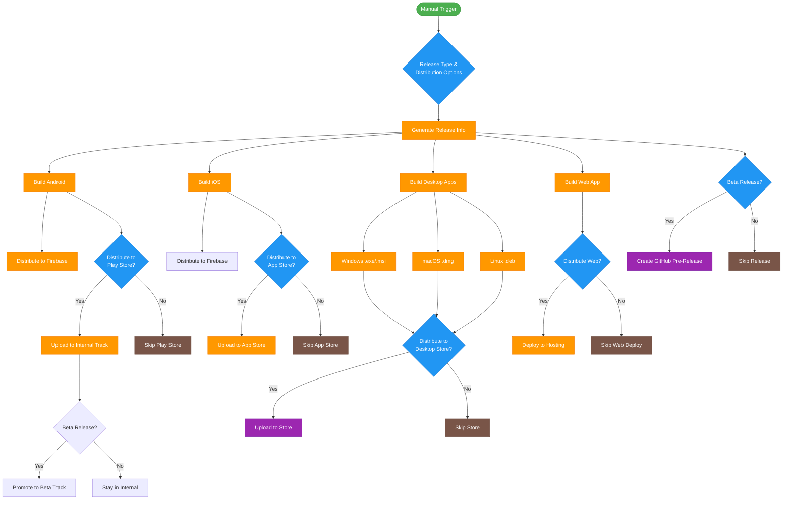
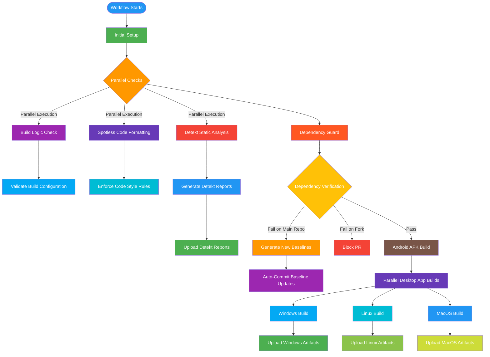
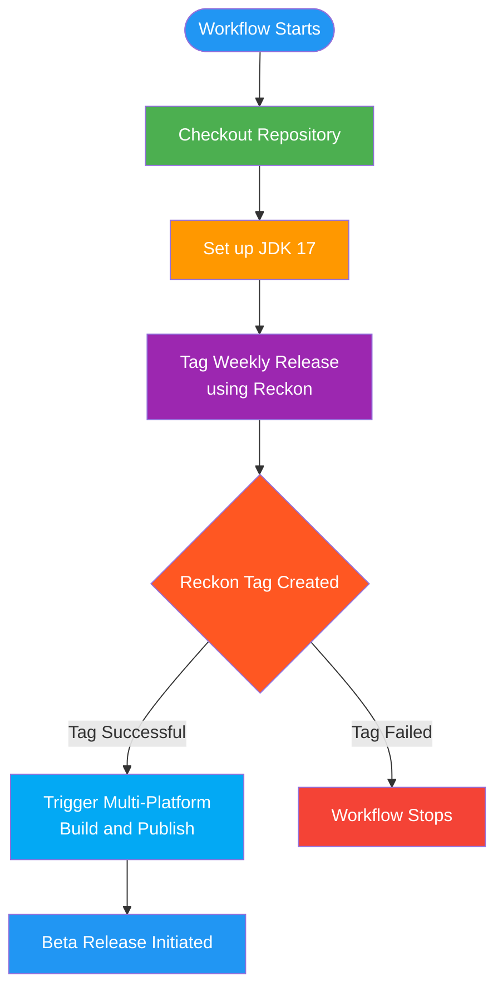

<div align="center"><a name="readme-top"></a>

# GitHub Actions Workflows for Multi-Platform App Development


&copy; 2024 [Mifos Initiative](https://github.com/openMF)

</div>


<details>
<summary><kbd>Table of contents</kbd></summary>

#### TOC
- [✨ Multi-Platform App Build and Publish Workflow](#multi-platform-app-build-and-publish-workflow)
  - [Workflow Usage Example](#workflow-usage-example)
- [✨ Kotlin/JS Web Application GitHub Pages Deployment Workflow](#kotlinjs-web-application-github-pages-deployment-workflow)
  - [Workflow Configuration](#workflow-configuration)
- [✨ Monthly Version Tagging Workflow](#monthly-version-tagging-workflow)
  - [Workflow Configuration](#workflow-configuration-1)
- [✨ PR Check Workflow](#pr-check-workflow)
  - [Workflow Usage Example](#workflow-usage-example-1)
- [✨ Promote Release to Play Store Workflow](#promote-release-to-play-store-workflow)
  - [Configuration Steps](#configuration-steps)
- [✨ Tag Weekly Release Workflow](#tag-weekly-release-workflow)
  - [Configuration Steps](#configuration-steps-1)

####
</details>

## Kotlin Multiplatform Project Setup Guide

### Supported Platforms
- Android
- iOS
- Desktop (Windows, macOS, Linux)
- Web (Kotlin/JS, wasmJS)

### Recommended Project Structure
```
project-root/
│
├── buildLogic/            # Shared build configuration
├── gradle/                # Gradle wrapper and configuration
│
├── core/                  # Core business logic module
│   ├── common/            # Common code shared across platforms
│   ├── model/             # Model classes and data structures
│   ├── data/              # Data models and repositories
│   ├── network/           # Networking and API clients
│   ├── domain/            # Domain-specific logic
│   ├── ui/                # UI components and screens
│   ├── designsystem/      # App-wide design system
│   └── datastore/         # Local data storage
│
├── feature/               # Feature Specific module
│   ├── feature-a/         # Feature-specific logic
│   ├── feature-b/         # Feature-specific logic
│   └── feature-c/         # Feature-specific logic
│
├── androidApp/            # Android-specific implementation
├── iosApp/                # iOS-specific implementation
├── desktopApp/            # Desktop application module
├── webApp/                # Web application module
│
├── shared/                # Shared Kotlin Multiplatform code
│   ├── src/
│   │   ├── commonMain/    # Shared business logic
│   │   ├── androidMain/   # Android-specific code
│   │   ├── iosMain/       # iOS-specific code
│   │   ├── desktopMain/   # Desktop-specific code
│   │   ├── jsMain/        # Web-specific code
│       └── wasmJsMain/    # Web-specific code
│
├── Fastfile              # Fastlane configuration
├── Gemfile               # Ruby dependencies
└── fastlane/             # Fastlane configurations
```

### Development Environment
- JDK 17 or higher
- Kotlin 1.9.x
- Gradle 8.x
- Android Studio Hedgehog or later
- Xcode 15+ (for iOS development)
- Node.js 18+ (for web development)


### Fastlane Setup

#### Install Fastlane
```bash
# Install Ruby (if not already installed)
brew install ruby

# Install Fastlane
gem install fastlane

# Create Gemfile
bundle init

# Add Fastlane to Gemfile
bundle add fastlane
```

#### Fastfile Configuration
`Fastfile`:
```ruby
default_platform(:android)

platform :android do
  desc "Deploy internal tracks to Google Play"
  lane :deploy_internal do
    supply(
      track: 'internal',
      aab: 'mifospay-android/build/outputs/bundle/prodRelease/mifospay-android-prod-release.aab',
      skip_upload_metadata: true,
      skip_upload_images: true,
      skip_upload_screenshots: true,
    )
  end

  desc "Promote internal tracks to beta on Google Play"
  lane :promote_to_beta do
    supply(
      track: 'internal',
      track_promote_to: 'beta',
      skip_upload_changelogs: true,
      skip_upload_metadata: true,
      skip_upload_images: true,
      skip_upload_screenshots: true,
    )
  end

  desc "Promote beta tracks to production on Google Play"
  lane :promote_to_production do
    supply(
      track: 'beta',
      track_promote_to: 'production',
      skip_upload_changelogs: true,
      sync_image_upload: true,
    )
  end

  desc "Upload Android application to Firebase App Distribution"
  lane :deploy_on_firebase do
    release = firebase_app_distribution(
        app: "1:728434912738:android:0490c291986f0a691a1dbb",
        service_credentials_file: "mifospay-android/firebaseAppDistributionServiceCredentialsFile.json",
        release_notes_file: "mifospay-android/build/outputs/changelogBeta",
        android_artifact_type: "APK",
        android_artifact_path: "mifospay-android/build/outputs/apk/prod/release/mifospay-android-prod-release.apk",
        groups: "mifos-wallet-testers"
    )
  end

end


platform :ios do
    desc "Build iOS application"
    lane :build_ios do
        build_ios_app(
            project: "mifospay-ios/iosApp.xcodeproj/project.pbxproj",
            # Set configuration to debug for now
            configuration: "Debug",
            output_directory: "mifospay-ios/",
            output_name: "mifospay-ios-app"
        )
    end

    desc "Upload iOS application to Firebase App Distribution"
    lane :deploy_on_firebase do
        increment_build_number(
          xcodeproj: "mifospay-ios/iosApp.xcodeproj/project.pbxproj"
        )

        build_ios_app(
            project: "mifospay-ios/iosApp.xcodeproj/project.pbxproj",
            # Set configuration to debug for now
            configuration: "Debug",
        )
        release = firebase_app_distribution(
            app: "1:728434912738:ios:86a7badfaed88b841a1dbb",
            service_credentials_file: "mifospay-android/firebaseAppDistributionServiceCredentialsFile.json",
            release_notes_file: "mifospay-android/build/outputs/changelogBeta",
            groups: "mifos-wallet-testers"
        )

    end
end

```

### Code Quality Checks
- Static code analysis (Detekt)
- Code formatting (Spotless)
- Dependency guard
- Unit and UI testing

### Release Management
- Semantic versioning
- Automated beta deployments
- Cross-platform release automation

### Resources
- [Kotlin Multiplatform Documentation](https://kotlinlang.org/docs/multiplatform.html)
- [Compose Multiplatform Guide](https://www.jetbrains.com/lp/compose-multiplatform/)
- [Fastlane Documentation](https://docs.fastlane.tools/)

<div align="right">

[](#readme-top)

</div>

---

# Multi-Platform App Build and Publish Workflow

> \[!TIP]
>  ####  _[multi_platform_build_and_publish.yaml](.github/workflows/multi-platform-build-and-publish.yaml)_ 👀️



## Overview

This GitHub Actions workflow provides a comprehensive solution for building and publishing multi-platform applications, supporting:

- Android (APK and Play Store)
- iOS (App Store and Firebase Distribution)
- Desktop (Windows, macOS, Linux)
- Web (GitHub Pages)

## Prerequisites

### Repository Setup

1. Ensure your project is organized with separate modules for each platform:

- Android module
- iOS module
- Desktop module
- Web module

2. Required configuration files:

- `fastlane/` directory with deployment configurations
- Gradle build files
- GitHub Secrets configuration

### Required GitHub Secrets

Configure the following secrets in your repository settings:

#### Android Secrets

- `ORIGINAL_KEYSTORE_FILE`: Base64 encoded release keystore
- `ORIGINAL_KEYSTORE_FILE_PASSWORD`: Keystore password
- `ORIGINAL_KEYSTORE_ALIAS`: Keystore alias
- `ORIGINAL_KEYSTORE_ALIAS_PASSWORD`: Keystore alias password
- 
- `UPLOAD_KEYSTORE_FILE`: Base64 encoded release keystore
- `UPLOAD_KEYSTORE_FILE_PASSWORD`: Keystore password
- `UPLOAD_KEYSTORE_ALIAS`: Keystore alias
- `UPLOAD_KEYSTORE_ALIAS_PASSWORD`: Keystore alias password
- 
- `GOOGLESERVICES`: Google Services JSON content
- `PLAYSTORECREDS`: Play Store service account credentials
- `FIREBASECREDS`: Firebase App Distribution credentials

#### iOS Secrets

- Notarization Credentials:
  - `NOTARIZATION_APPLE_ID`
  - `NOTARIZATION_PASSWORD`
  - `NOTARIZATION_TEAM_ID`

## Workflow Inputs

The workflow supports the following configuration inputs:

### Release Configuration

- `release_type`:
  - Default: `'internal'`
  - Options: `'internal'`, `'beta'`
- `target_branch`:
  - Default: `'dev'`
  - Specifies the branch for release

### Platform Package Names

- `android_package_name`: Name of Android project module
- `ios_package_name`: Name of iOS project module
- `desktop_package_name`: Name of Desktop project module
- `web_package_name`: Name of Web project module

### Publishing Toggles

- `publish_android`: Publish to Play Store (Default: `false`)
- `build_ios`: Build iOS App (Default: `false`)
- `publish_ios`: Publish to App Store (Default: `false`)
- `publish_desktop`: Publish Desktop Apps (Default: `false`)
- `publish_web`: Publish Web App (Default: `true`)

## Workflow Jobs

### 1. Release Information Generation

- Generates version number
- Creates release notes
- Prepares changelog artifacts

### 2. Platform-Specific Build Jobs

#### Android

- Builds signed APK
- Uploads to Firebase App Distribution
- Optionally publishes to Play Store

#### iOS

- Builds iOS application
- Uploads to Firebase App Distribution
- Prepares for App Store submission

#### Desktop

- Builds for Windows, macOS, and Linux
- Packages executables and installers

#### Web

- Builds web application
- Deploys to GitHub Pages

### 3. GitHub Release

- Creates a pre-release with all built artifacts
- Includes detailed changelog

## Workflow Usage Example

```yaml
name: Multi-Platform(Re-Usable) App Build and Publish

on:
  workflow_dispatch:
    inputs:
      release_type:
        type: choice
        options:
          - internal
          - beta
        default: internal
        description: Release Type

      target_branch:
        type: string
        default: 'dev'
        description: 'Target branch for release'

      publish_android:
        type: boolean
        default: false
        description: Publish Android App On Play Store

      publish_ios:
        type: boolean
        default: false
        description: Publish iOS App On App Store

      publish_desktop:
        type: boolean
        default: false
        description: Publish Desktop Apps On App Store

      publish_web:
        type: boolean
        default: true
        description: Publish Web App

      build_ios:
        type: boolean
        default: false
        description: Build iOS App

permissions:
  contents: write
  id-token: write
  pages: write

concurrency:
  group: "reusable"
  cancel-in-progress: false

jobs:
  multi_platform_build_and_publish:
    name: Multi-Platform Build and Publish
    uses: niyajali/mifos-mobile-github-actions/.github/workflows/multi-platform-build-and-publish.yaml@main
    secrets: inherit
    with:
      android_package_name: 'mifospay-android'
      ios_package_name: 'mifospay-ios'
      desktop_package_name: 'mifospay-desktop'
      web_package_name: 'mifospay-web'
      release_type: ${{ inputs.release_type }}
      target_branch: ${{ inputs.target_branch }}
      publish_android: ${{ inputs.publish_android }}
      build_ios: ${{ inputs.build_ios }}
      publish_ios: ${{ inputs.publish_ios }}
      publish_desktop: ${{ inputs.publish_desktop }}
      publish_web: ${{ inputs.publish_web }}
```

## Important Considerations

1. Ensure all platform-specific build configurations are correctly set up
2. Test the workflow in a staging environment first
3. Manage secrets securely
4. Keep Fastlane and Gradle configurations up to date

## Troubleshooting

- Check GitHub Actions logs for detailed error messages
- Verify all secrets are correctly configured
- Ensure Gradle and Fastlane dependencies are compatible
- Validate platform-specific build scripts

## Limitations

- Requires comprehensive platform-specific build configurations
- Some manual setup needed for each platform
- Depends on external services (Play Store, App Store, Firebase)

<div align="right">

[](#readme-top)

</div>

---

# Kotlin/JS Web Application GitHub Pages Deployment Workflow

> \[!TIP]
> #### [_build-and-deploy-site.yaml_](.github/workflows/build-and-deploy-site.yaml)


## Overview

This GitHub Actions workflow automates the build and deployment of a Kotlin/JS web application to GitHub Pages. It simplifies the process of publishing your web application by automatically handling the build and deployment steps whenever changes are merged into the development branch.

## Prerequisites

Before using this workflow, ensure you have the following:

### Repository Setup

1. A Kotlin Multiplatform/JS web application project using Gradle
2. A Gradle configuration that supports `jsBrowserDistribution` task
3. GitHub repository with GitHub Pages enabled

### Build Configuration

- Use Java 17
- Kotlin/JS project with a web module
- Gradle wrapper in the project root

## Workflow Configuration

### 1. How to Setup the Workflow

This workflow is designed as a reusable workflow. You'll need to call it from another workflow file. Create a workflow file (e.g., `.github/workflows/deploy.yml`) that looks like this:

```yaml
name: Build And Deploy Web App

# Trigger conditions for the workflow
on:
  pull_request:
    branches: [ "dev" ]
    types: [ closed ]
  workflow_dispatch:

# Concurrency settings to manage multiple workflow runs
# This ensures orderly deployment to production environment
concurrency:
  group: "web-pages"
  cancel-in-progress: false

permissions:
  contents: read  # Read repository contents
  pages: write    # Write to GitHub Pages
  id-token: write # Write authentication tokens
  pull-requests: write # Write to pull requests

jobs:
  build_and_deploy_web:
    name: Build And Deploy Web App
    uses: niyajali/mifos-mobile-github-actions/.github/workflows/build-and-deploy-site.yaml@main
    secrets: inherit
    with:
      web_package_name: 'mifospay-web'
```

Replace `'your-web-module-name'` with the actual name of your web module in the Gradle project.

### 2. GitHub Pages Configuration

#### Repository Settings

1. Go to your repository's "Settings" tab
2. Navigate to "Pages" section
3. Under "Source", select "GitHub Actions" as the deployment method

### 4. Gradle Configuration

Ensure your `build.gradle.kts` or `build.gradle` supports JavaScript distribution:

```kotlin
kotlin {
    js(IR) {
        browser {
            // Browser-specific configuration
            binaries.executable()
        }
    }
}
```

## Workflow Details As Per Above Example

### Workflow Triggers

- Automatically triggered on push to the `dev` branch
- Can be manually triggered via GitHub Actions UI

### Environment

- Runs on Windows with Java 17
- Uses Zulu OpenJDK distribution

### Deployment Steps

1. Checkout repository
2. Setup Java environment
3. Build web application using `jsBrowserDistribution`
4. Configure GitHub Pages
5. Upload build artifacts
6. Deploy to GitHub Pages

## Troubleshooting

### Common Issues

- Ensure Gradle wrapper is executable (`chmod +x gradlew`)
- Verify web module name matches exactly in workflow configuration
- Check that `jsBrowserDistribution` task works locally

### Debugging

- Review workflow run logs in the "Actions" tab of your GitHub repository
- Verify build artifacts are generated correctly
- Check GitHub Pages settings

## Security Considerations

- Workflow uses minimal required permissions
- Concurrency settings prevent conflicting deployments

## Version Compatibility

- Tested with:
  - GitHub Actions: v4-v5
  - Java: 17
  - Kotlin/JS: Latest versions

<div align="right">

[](#readme-top)

</div>

---

# Monthly Version Tagging Workflow

> \[!TIP]
> 
> #### [_monthly-version-tag.yaml_](.github/workflows/monthly-version-tag.yaml)


## Overview

This GitHub Actions workflow automates the creation of monthly version tags for your repository. It follows a calendar-based versioning scheme, generating tags that represent the year and month of release.

## Versioning Scheme

The workflow creates tags in the format: `YYYY.MM.0`

- `YYYY`: Full four-digit year
- `MM`: Two-digit month
- `.0`: Initial release for the month (allows for potential patch releases)

**Example Tags:**

- `2024.01.0` (January 2024's initial release)
- `2024.12.0` (December 2024's initial release)

## Prerequisites

### Repository Setup

1. GitHub repository with write access to tags
2. GitHub Actions enabled

### Workflow Configuration

#### Create Workflow File

Create a new workflow file in `.github/workflows/monthly-version-tag.yml`:

```yaml
name: Tag Monthly Release

on:
  # Allow manual triggering of the workflow
  workflow_dispatch:
  # Schedule the workflow to run monthly
  schedule:
    # Runs at 03:30 UTC on the first day of every month
    # Cron syntax: minute hour day-of-month month day-of-week
    - cron: '30 3 1 * *'

concurrency:
  group: "monthly-release"
  cancel-in-progress: false

jobs:
  monthly_release:
    name: Tag Monthly Release
    uses: niyajali/mifos-mobile-github-actions/.github/workflows/monthly-version-tag.yaml@main
    secrets: inherit
```

## Workflow Details

### Trigger Conditions

- **Automatic:** First day of each month at 3:30 AM UTC
- **Manual:** Can be triggered via GitHub Actions UI

### Environment

- Runs on Ubuntu latest
- Uses GitHub Actions environment

### Workflow Steps

1. Checkout repository
2. Retrieve current timestamp
3. Create version tag based on current year and month

## Third-Party Actions Used

### 1. `josStorer/get-current-time@v2.1.2`

- Provides current date and time information
- Extracts year and month for tag creation

### 2. `rickstaa/action-create-tag@v1.7.2`

- Creates Git tags in the repository
- Supports custom tag naming

## Customization Options

### Modify Versioning Scheme

- Adjust tag format in the `tag` parameter
- Add additional logic for more complex versioning

### Change Scheduling

- Modify the cron schedule to suit your release cadence
- Adjust timezone or specific day of the month

## Security Considerations

- Workflow uses minimal repository permissions
- Runs on a trusted GitHub-hosted runner

## Troubleshooting

### Common Issues

- Verify GitHub Actions permissions
- Check repository branch protection rules
- Ensure no existing tags conflict

### Debugging

- Review workflow run logs in the "Actions" tab
- Manually trigger workflow to test configuration

## Version Compatibility

- Tested with:
  - GitHub Actions: v4
  - Ubuntu: Latest
  - Third-party actions: Specified versions

## Best Practices

- Use this for consistent, predictable versioning
- Consider combining with release notes or changelog generation
- Review tags periodically to maintain clarity

<div align="right">

[](#readme-top)

</div>

---

# PR Check Workflow

> \[!TIP]
> #### [_pr_check.yml_](.github/workflows/pr-check.yaml)



## Overview

This GitHub Actions workflow provides a robust continuous integration (CI) process for the Mobile-Wallet project, focusing on:
- Code quality checks
- Dependency verification
- Multi-platform builds (Android and Desktop)

## Workflow Trigger

The workflow is designed to be reusable and can be called from other workflows with specific inputs.

## Prerequisites

### Project Structure
1. Kotlin/Gradle-based multi-platform project
2. Separate modules for:
  - Android application
  - Desktop application
3. Configured code quality tools:
  - Spotless (code formatting)
  - Detekt (static code analysis)
  - Dependency Guard

### Required Configurations

#### Build Tools
- Java 17
- Gradle
- Kotlin Multiplatform (recommended)

#### Code Quality Plugins
- Spotless
- Detekt
- Dependency Guard

## Workflow Inputs

### Required Inputs
- `android_package_name`: Name of the Android project module
- `desktop_package_name`: Name of the Desktop project module

## Workflow Jobs

### 1. Setup Job
- Checks out repository
- Sets up Java 17
- Configures Gradle
- Caches Gradle dependencies to optimize build performance

### 2. Code Quality Checks
Runs three parallel checks:
- `build_logic`: Validates build scripts
- `spotless`: Ensures consistent code formatting
- `detekt`: Performs static code analysis

#### Outputs
- Detekt reports uploaded as artifacts

### 3. Dependency Guard
- Verifies project dependencies
- Can automatically update dependency baselines
- Prevents dependency updates in forked repositories

### 4. Android Build
- Builds debug APK for demo flavor
- Uploads built APKs as artifacts

### 5. Desktop Application Build
Builds desktop applications for:
- Windows
- Linux
- macOS

#### Outputs
- Platform-specific executables and installers

## Workflow Usage Example

```yaml
name: PR Checks

# Trigger conditions for the workflow
on:
  push:
    branches: [ dev ]  # Runs on pushes to dev branch
  pull_request:       # Runs on all pull requests

# Concurrency settings to prevent multiple simultaneous workflow runs
concurrency:
  group: pr-${{ github.ref }}
  cancel-in-progress: true  # Cancels previous runs if a new one is triggered

permissions:
  contents: write

jobs:
  pr_checks:
    name: PR Checks
    uses: niyajali/mifos-mobile-github-actions/.github/workflows/pr-check.yaml@main
    secrets: inherit
    with:
      android_package_name: 'mifospay-android'
      desktop_package_name: 'mifospay-desktop'
```

## Best Practices

1. Keep code formatting consistent
2. Regularly update dependency baselines
3. Address static code analysis warnings
4. Maintain separate build configurations for different flavors

## Troubleshooting

### Common Issues
- Gradle cache conflicts
- Java version mismatches
- Dependency resolution problems

### Debugging Steps
1. Clear Gradle caches
2. Verify Java installation
3. Check dependency configurations
4. Review Detekt and Spotless reports

## Customization

### Extending the Workflow
- Add more code quality checks
- Implement additional build flavors
- Customize artifact retention

## Limitations
- Requires comprehensive project setup
- Platform-specific builds increase workflow complexity
- Longer build times due to multiple checks and builds

<div align="right">

[](#readme-top)

</div>

---

# Promote Release to Play Store Workflow
> \[!TIP]
> #### [_promote_to_production.yml_](.github/workflows/promote-to-production.yaml)


### Overview
This workflow automates the promotion of a beta release to the production environment on the Google Play Store.

### Workflow Trigger
- Callable workflow (can be invoked from other workflows)

### Prerequisites
1. **Ruby Environment**
  - Requires Ruby setup (uses `ruby/setup-ruby` action)
  - Bundler version 2.2.27
  - Fastlane installed with specific plugins

2. **Required Plugins**
  - `firebase_app_distribution`
  - `increment_build_number`

### Configuration Steps
1. **Repository Setup**
  - Ensure your repository is properly structured for Android app deployment
  - Have a `Fastfile` configured with `promote_to_production` lane

2. **Fastlane Configuration**
   Create a `Fastfile` in your `fastlane` directory with a `promote_to_production` lane:
   ```ruby
   default(:android)
   lane :promote_to_production do
     # Your specific Play Store promotion logic
     supply(
       track: 'beta',
       track_promote_to: 'production'
     )
   end
   ```

3. **GitHub Secrets**
  - Ensure you have Play Store credentials configured in your repository secrets
  - Typically includes:
    - `$PLAYSTORE_CREDS`: Google Play Service Account JSON
    - Other authentication credentials as needed

### Workflow Parameters
- No direct input parameters
- Uses environment variable `SUPPLY_UPLOAD_MAX_RETRIES` (default: 5)

### Best Practices
- Ensure your beta release is thoroughly tested before promotion
- Use version tagging and semantic versioning
- Keep Play Store credentials secure

### Example Workflow
```yaml
name: Promote Release to Play Store

# Workflow triggers:
# 1. Manual trigger with option to publish to Play Store
# 2. Automatic trigger when a GitHub release is published
on:
  workflow_dispatch:
    inputs:
      publish_to_play_store:
        required: false
        default: false
        description: Publish to Play Store?
        type: boolean
  release:
    types: [ released ]

concurrency:
  group: "production-deploy"
  cancel-in-progress: false

permissions:
  contents: write

jobs:
  # Job to promote app from beta to production in Play Store
  play_promote_production:
    name: Promote Beta to Production Play Store
    uses: niyajali/mifos-mobile-github-actions/.github/workflows/promote-to-production.yaml@main
    if: ${{ inputs.publish_to_play_store == true }}
    secrets: inherit
    with:
      android_package_name: 'mifospay-android'
```

<div align="right">

[](#readme-top)

</div>

---

# Tag Weekly Release Workflow
> \[!TIP]
> #### [_tag_weekly_release.yml_](.github/workflows/tag-weekly-release.yaml)



### Overview
This workflow automatically creates weekly version tags and triggers beta releases every Sunday at 4:00 AM UTC.

### Workflow Trigger
- Scheduled run: Every Sunday at 4:00 AM UTC
- Manual dispatch possible

### Prerequisites
1. **Java Environment**
  - JDK 17 (Temurin distribution)
  - Gradle with Reckon plugin for versioning

2. **Tools Required**
  - Gradle
  - Reckon plugin for automatic versioning

### Configuration Steps
1. **Gradle Configuration**
   Add Reckon plugin to your `build.gradle`:
   ```groovy
   plugins {
     id 'org.ajoberstar.reckon' version 'x.x.x'
   }

   reckon {
     scopeFromProp()
     stageFromProp()
   }
   ```

2. **GitHub Workflow Inputs**
  - `target_branch`: Branch for release (default: 'dev')
    - Allows specifying which branch to use for releases

3. **GitHub Secrets**
  - `GITHUB_TOKEN`: Automatically provided by GitHub Actions
  - Enables pushing tags and triggering subsequent workflows

### Workflow Process
1. Checks out repository with full history
2. Sets up Java 17 environment
3. Creates and pushes a new version tag using Reckon
  - Uses 'final' stage for production-ready releases
4. Triggers a multi-platform build and publish workflow
  - Passes 'beta' as the release type

### Best Practices
- Ensure your versioning strategy is consistent
- Test Reckon configuration thoroughly
- Review and validate auto-generated tags
- Set up appropriate branch protection rules

### Customization
- Modify schedule using cron syntax
- Adjust target branch as needed
- Customize release type and versioning strategy

### Troubleshooting
- Check GitHub Actions logs for detailed error information
- Verify Gradle and Reckon plugin configurations
- Ensure all required secrets and permissions are set up

### Example Workflow
```yaml
# Workflow to automatically create weekly version tags and trigger beta releases
# This workflow runs every Sunday at 4:00 AM UTC and can also be triggered manually

name: Tag Weekly Release

on:
  # Allow manual triggering of the workflow
  workflow_dispatch:
  # Schedule the workflow to run weekly
  schedule:
    # Runs at 04:00 UTC every Sunday
    # Cron syntax: minute hour day-of-month month day-of-week
    - cron: '0 4 */2 * 0'

concurrency:
  group: "weekly-release"
  cancel-in-progress: false

jobs:
  tag:
    name: Tag Weekly Release
    uses: niyajali/mifos-mobile-github-actions/.github/workflows/tag-weekly-release.yaml@main
    secrets: inherit
    with:
      target_branch: 'dev'
```
